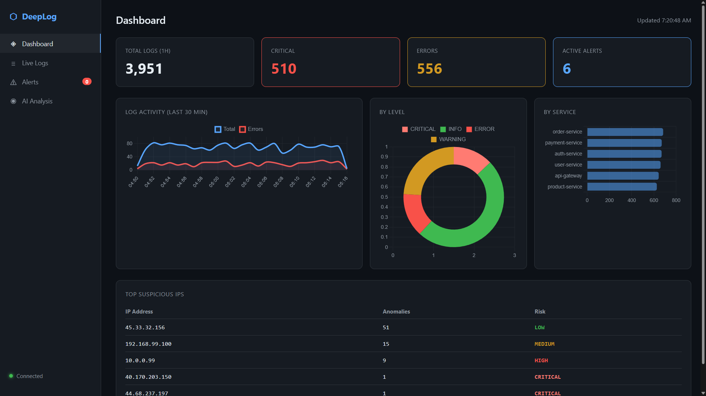

# DeepLog — AI-Powered Log Analytics Platform

> Real-time log monitoring with Groq AI anomaly detection, built with Node.js + MongoDB

---

## Screenshots




---

## Setup

### 1. Install dependencies
```bash
npm install
```

### 2. Configure environment
```bash
copy .env.example .env
```

Edit `.env` and fill in:
- **MONGODB_URI** — from [MongoDB Atlas](https://www.mongodb.com/atlas) (free tier)
- **GROQ_API_KEY** — from [Groq Console](https://console.groq.com) (free, no credit card)

### 3. Seed the database
```bash
npm run seed
```

### 4. Start the server
```bash
npm run dev
```

### 5. Open the dashboard
```
http://localhost:3000
```

---

## Project Structure

```
deeplog/
├── backend/
│   ├── models/
│   │   ├── Log.js              # Log schema + indexes
│   │   └── Alert.js            # Alert schema
│   ├── routes/
│   │   ├── logs.js             # GET/POST logs + aggregation stats
│   │   ├── alerts.js           # Alerts CRUD + manual scan
│   │   └── ai.js               # Groq AI summary endpoint
│   ├── services/
│   │   ├── db.js               # MongoDB connection
│   │   ├── groq.js             # Groq AI integration (LLaMA 3.3 70B)
│   │   └── anomalyDetector.js  # Brute force, DDoS, spike detection
│   └── server.js               # Express + Socket.io server
├── frontend/
│   └── public/
│       ├── index.html          # Dashboard UI
│       ├── css/style.css       # Styles
│       └── js/app.js           # Frontend logic + charts
├── scripts/
│   └── generateLogs.js         # Seeds 100k logs + attack patterns
├── .env.example
└── package.json
```

---

## Features

| Feature | Details |
|---|---|
| **Real-time logs** | Socket.io streams incoming logs live to the dashboard |
| **Aggregation stats** | MongoDB pipelines: by level, source, timeline, top IPs |
| **Anomaly detection** | Auto-detects Brute Force, DDoS, and Error Spikes |
| **Groq AI analysis** | LLaMA 3.3 70B explains each anomaly in plain English |
| **AI health report** | Summary of system status based on last 5 minutes of logs |
| **Alert management** | Resolve and track security alerts |
| **Seed data** | 100k realistic logs with embedded attack patterns |

---

## API Endpoints

```
GET   /api/logs                   Paginated logs (filter by level, source, ip)
POST  /api/logs                   Ingest a new log
GET   /api/logs/stats             Aggregated stats (charts data)
GET   /api/alerts                 List all alerts
POST  /api/alerts/scan            Trigger manual AI anomaly scan
PATCH /api/alerts/:id/resolve     Mark alert resolved
GET   /api/ai/summary             Groq AI health summary
```

---

## Tech Stack

- **Backend** — Node.js, Express
- **Database** — MongoDB Atlas, Mongoose
- **Real-time** — Socket.io
- **AI** — Groq API (LLaMA 3.3 70B)
- **Frontend** — HTML, CSS, Chart.js